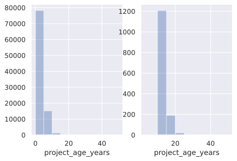
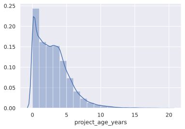
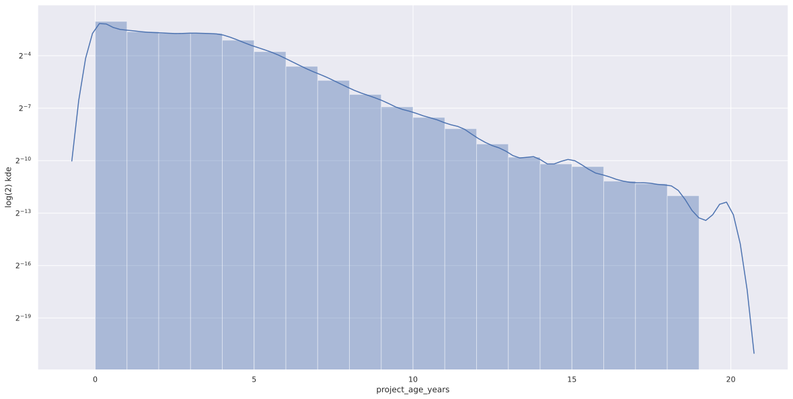
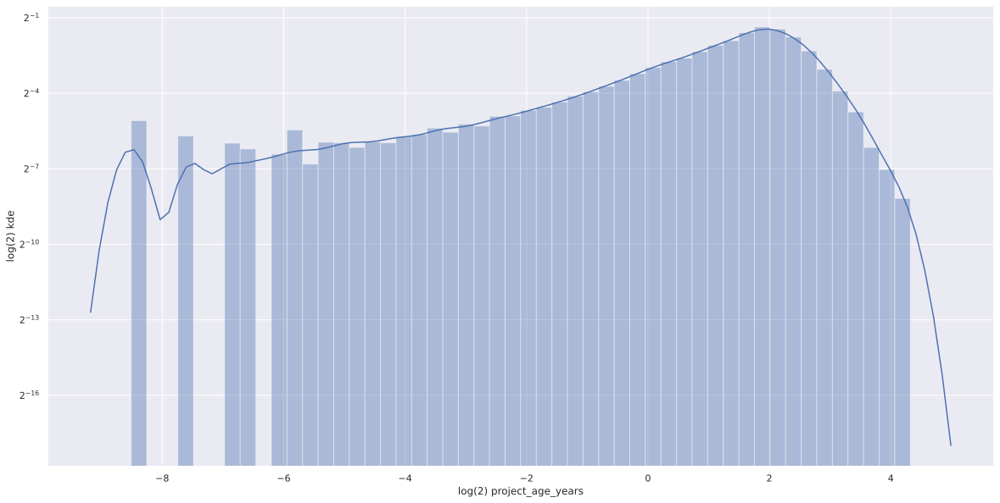
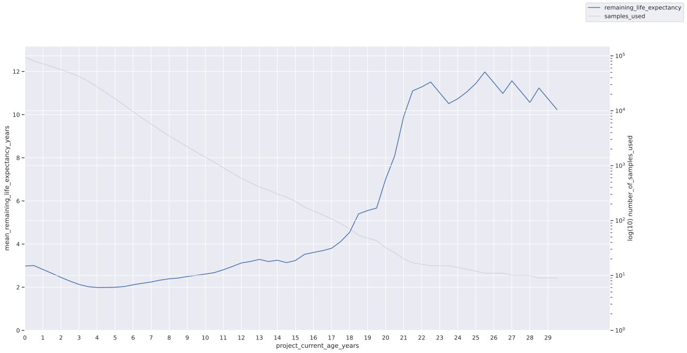
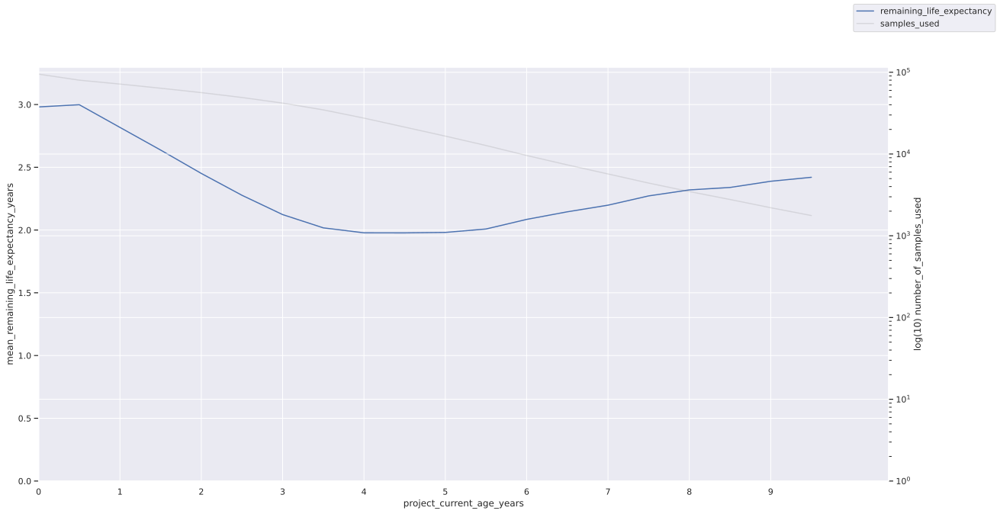

How long should we expect themes and technologies in software engineering to last?
In this post, we'll look at how long individual projects "last" based on data from GitHub
and try to draw conclusions around what that means for choosing foundational software.

Software comes and goes - except when it doesn't. When we're building something new, 
what kind of technologies should we build on? Should we seek maturity
and stability - perhaps seeking to reduce the constant churn of keeping up with
the latest updates, and benefit from the battle-hardening effect of exposure to
the real world and the passing of time - or should we eschew staleness, and 
build on foundations that aren't already aproaching the end of their shelf-life - 
benefiting from the latest advances in technology, and learning from the mistakes
of those who went before.

It goes without saying that our choice will depend on what it is we're building;
are we most concerned with getting an idea in front of users ASAP, or with
the ongoing cost of maintenance once we've shipped? Are we reasonably sure about
the problem space, or do we expect a lot of before we have the basics right? 

## what can we know?

One way to start thinking about answering these questions would be to talk about
the longevity of tools and projects. Can we make predictions about how long a
given technology will be around, given its history? That's what we'll look at
in the rest of this post: can we judge whether a project will still be around
in a few years' time based on how long it has been around.

## prior art

* There was a pretty popular blog post a few years ago called [choose boring technology](https://mcfunley.com/choose-boring-technology). 
  In it, McKinley talks about the idea of *innovation tokens* - the idea is that you
  only have so much *innovation* to spend, and if you go off the beaten path, then
  you're using those up - by implication, you don't have so many left to spend on
  your "real" problem (the thing that gave you a reason to write software in the
  first place).
  
* Taleb and the Antifragile Software folks talk about the 
  [Lindy Effect](https://en.wikipedia.org/wiki/Lindy_effect). The idea here is
  that we can just a thing's life expentancy by how long it has already been
  around - and that the life expentancy *increases* with every year something
  has been around (contingent on the thing not having some natural upper limit;
  sofware being an obvious example of something non-perishable)
  
Inspired by both of these ideas, let's make a hypothesis:

> The longer a project has been around, the longer its expected remaining life.

Notice, this prediction is obviously false for things with naturally bounded
lifespans, since remaining life expectancy must decrease as you approach that
upper bound. But what about software projects?

## what can we measure?

GitHub provide a [BigQuery dataset](https://console.cloud.google.com/marketplace/details/github/github-repos?filter=solution-type:dataset&q=github&id=46ee22ab-2ca4-4750-81a7-3ee0f0150dcb)
comprising 3TB of data on activity around GitHub-hosted open source projects.

This dataset gives us a few things, but most usefully (I hope): commit history.
Let's simplify things and say that a project's age is the time between the first
and last commit, and that it's said to be "done" if there has been no commit in
the last 3 months (i.e. exclude still-active projects from the sample).

Here's the query I used to pull information about the first and last commits for
each project:

```sql
with commits_by_repo as (
  SELECT rname as repo_name, cs.committer.time_sec ts, commit
  FROM `bigquery-public-data.github_repos.commits` cs
  CROSS JOIN unnest(cs.repo_name) as rname
  join `bigquery-public-data.github_repos.sample_repos` sam_rs 
    on rname = sam_rs.repo_name
  where sam_rs.watch_count > 3
  and committer.time_sec >= 2674800
)
select 
  cs.repo_name as project_name, 
  min(cs.ts) earliest_commit_sec, 
  max(cs.ts) latest_commit_sec, 
  count(distinct commit) number_of_commits
from commits_by_repo cs
group by project_name
order by earliest_commit_sec asc

```

And [here's](lindy-tech/ProjectCommitTimingAnalysis.ipynb) the notebook
I used to analyze the results and produce the plots below. If you want to
follow along you'll have to pull the data out of BigQuery and point the
notebook at your own CSV file.

A few remarks:
- The data quality here is... patchy. A few examples:
  - a [JavaScript project](https://github.com/volumio/Volumio2.git) with commits
    before the invention of HTML
  - More than one version of golang with [commits](https://github.com/cloudflare/go/commits/0bb0b61d6a85b2a1a33dcbc418089656f2754d32) that look like they might be
    imported from the very inception of C
  - This project with [commits](https://github.com/openmole/openmole/commits/ca6510d929d16d8f5d59d472dc968ba597303f89) 
    nearly 100 years in the future
  
  None of this should be hugely surprising; people can write whatever they want
  in their commit history, and sometimes they (or their tools) will write nonsense!
- The [GitHub press release](https://medium.com/google-cloud/github-on-bigquery-analyze-all-the-code-b3576fd2b150) says that "Forks and/or 
  un-notable projects not included." I'm not so sure about that (c.f. the
  multiple copies of Go referenced above). Again, hardly surprising; it wouldn't
  be easy for GitHub to reliably detect forks; it's perfectly possible to have
  two completely separate projects that happen to share some commits, but neither
  one obviusly be a fork of the other.

In the query above, I've taken a few steps to try to filter out things that I'm
*guessing* are going to be more signal than noise:
- Ignore anything with a timestamp in Jan 1970. There certainly was software
  development happening at the time, but from eyeballing the data, there're also
  a lot of commits with dodgey timestamps.
- Join on the somewhat cut-down `sample_repos` dataset, and filter for things with
  some stars. This will exclude a lot of one-shot "hobby" projects that I suspect
  would be a good addition to the dataset (many datapoints for "projects that live
  hardly any time at all"), but I also suspect them of containing lots of junk,
  and hope it might cut out some personal mirrors etc.

So, what do we find?

## results

Here are some plots of the distributions of project age.

First, a straightforward plot of the distribution of project lifetimes:


There are only 32 projects in the dataset with an age > 20 years. That's such a
small number compared to the earlier samples that I'm going to exclude anything
with age > 20 years from the following distribution plots. Chopping off this 
long tail may change the shape of the distribution, but I'll justify it by 
mentioning that even within this small sample, there are quite a few projects 
that are clearly noise rather than signal:
- [scwuaptx/CTF](https://github.com/scwuaptx/CTF) - writeups of CTFs, which look to
  only really go back as far as 2015
- [eregon/mozart-graal](https://github.com/eregon/mozart-graal) - a project
  built on top of the [GraalVM](https://en.wikipedia.org/wiki/GraalVM), whose
  first "production ready" release was in 2019.

The cost is excluding (several forks of...) projects like Emacs.

Each of the following graphs is a [seaborn distplot](https://seaborn.pydata.org/tutorial/distributions.html)
showing project age (in years) on the x-axis and the kernel density estimate
the y-axis. 

First, the distribution of what's left after filtering:


Next, the same data on a log scale (filtered for only projects with age < 20 years):


Finally, the same data on a log-log scale:


A couple of observations:
- Power-law distributions (of the type described by Taleb's expression of the 
  Lindy Effect above) [show a straight line on a log-log plot](https://en.wikipedia.org/wiki/Power_law#Graphical_methods_for_identification)
  as a necessary-but-not-sufficient condition. We don't seem to see that here;
  implying that, at least by this measure of project lifespan, projects on github
  *don't* follow a power-law distribution with respect to age.
- We see a clear straight downward slope on the log-graph, once a project reaches
  its fourth year

Now, back to our hypothesis:

> The longer a project has been around, the longer its expected remaining life.

Here's a graph of expected (mean) lifespan (on the y-axis), predicated on current
lifespan in years (on the x-axis). First time round, let's re-include 32 
projects with a lifespan > 20 years:



Woah there. Taken at face value, this graph seems to imply that our hypothesis
is true, in a big way: a project's remaining life expectancy increases once
it hits four years of age, and damatically so after about 15 years. But remember,
we've only got 32 data points (some of which we know to be junk) after the 20
year mark, so a few data points are going to dominate the picture. To emphasize 
how little data we have here, I've included the KDE we saw earlier in grey.

What can we do about this?
- If we chop the data down to exclude data points >, say, 15 years, then we
  will be imposing an artificial limit on the upper bound of life expectancy.
  This would rule out our hypothesis by construction.
- We can keep all the data, but only look at the remaining life expectancies
  for those with "enough" data points after them to make some resonable
  judgement of what that expectancy might be.

I've done... a mix:
- I've projected the remaining life expectancy only of projects up to 10 years
  of age. There are still a decent number of projects older than that that we can
  hope to use to project a life expectancy.
- To estimate that remaining life expectancy, I've excluded projects where
  the recorded life span is > 30 years. The projects in that group are just 
  too noisey to consider.

So, I have imposed an artificial limit on project life (30 years), but 
hopefully that's high enough that it's not going to skew the results for 
projects we consider (10 years or younger). I'd love to hear from someone more
statistically literate if there's a better way to go about this - I'm sure there
must be.

So, finally, here's a graph showing expected remaining life expectancy of a
project, given its current age. 



I think that leaves us with a much more guarded conclusion: at around the four
year mark, projects seem to reach some sort of maturity threshold or critical 
mass, and from then on their expected remaining lifetime may increase.

## further work

Better analysis:
- I've used a very crude measure of project liveness: looking only at
  commits. It's perfectly possible for a project to have an active and
  engaged community, with no code changes for a few months. A smattering of
  things I'd want to think about for a really confident idea of a project 
  being "done" might include:
  - Are new issues being filed in the issue tracker? This implies that
    *someone* is still using it
  - Are issues being reponsded to?
  - Is there an active StackOverflow community?
- Cohorting of project types; perhaps libraries have very different
  lifecycles to programming languages? How about frameworks vs. libraries?

Sources of bias in the data:
- How to account for still-live projects? This analysis excludes any projects
  that are still active - and if the hypothesis is true (longer-lived projects
  will stay active), then this sampling bias will skew results against that
  conclusion.
- There are plenty of long-lived projects that would meaningfully contribute 
  to the long tail. By excluding "old" projects, I'm excluding exactly those
  that could provide the most interesting counterexamples.